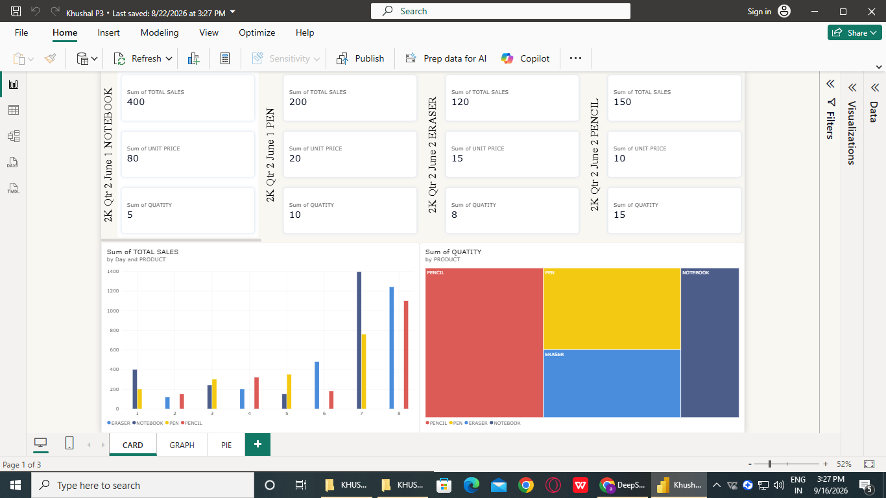
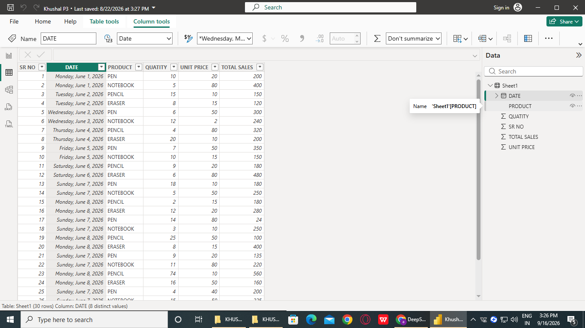
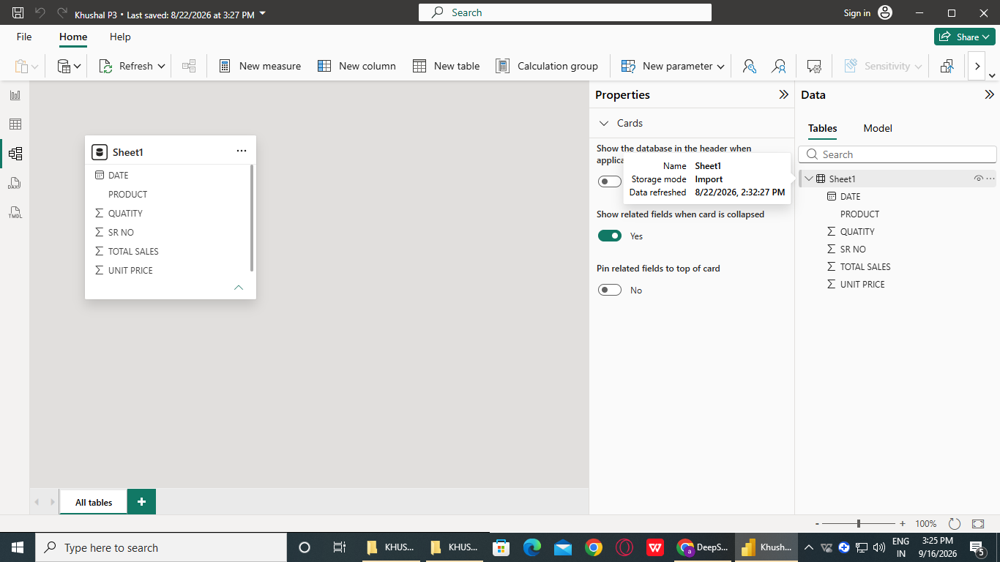
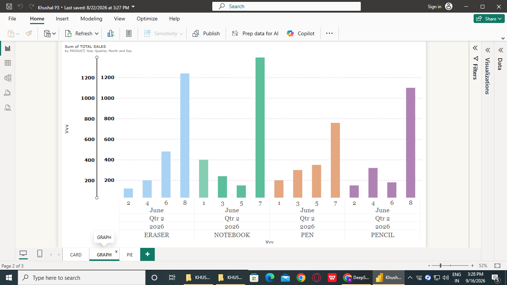
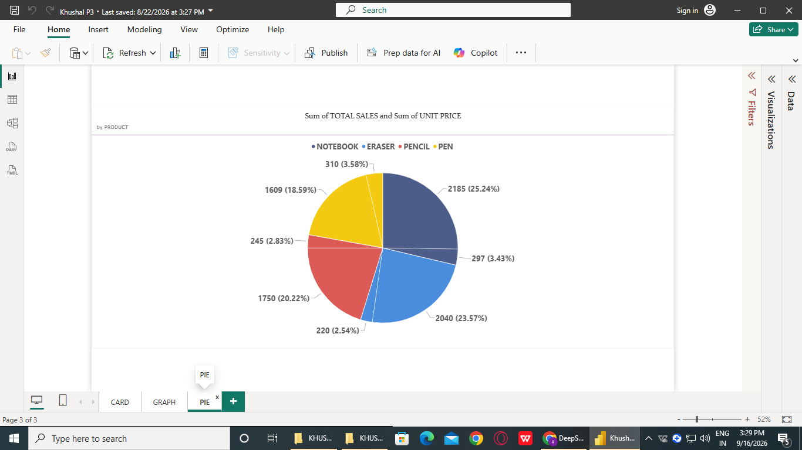

## 📊 Sales Analytics Dashboard - Khusal P3


## 📖 Project Overview
Welcome to the **Khusal P3 Sales Dashboard**! This project is an interactive Business Intelligence (BI) solution built using **Microsoft Power BI**. It transforms raw sales data (from June 1st to June 8th, 2026) into actionable insights across multiple product categories: **Notebooks, Pens, Erasers, and Pencils**.

The dashboard provides a comprehensive view of Total Sales, Unit Prices, and Quantities sold, allowing stakeholders to make data-driven decisions.

## 🚀 Key Features
- **Dynamic KPI Cards:** Instant view of Total Sales, Unit Prices, and Quantities.
- **Data Grid:** Clean, tabular view of all transactions (SR NO, Date, Product, Quantity, Unit Price, Total Sales).
- **Interactive Bar Graph:** Comparison of Sales by Day and Product.
- **Comprehensive Pie Chart:** Distribution of Sales by Product Category.
- **Data Modeling:** Optimized data model with calculated columns and measures.

## 📸 Screenshots

### 1. Card View & Bar Graph

*Interactive dashboard showing top-level KPIs and daily sales trends.*

### 2. Raw Data Table

*Detailed transaction records for the period June 1 - June 8, 2026.*

### 3. Data Model View

*Star schema structure showing the relationship between the Sales table and dimensions.*

### 4. Advanced Bar Graph (Time Series)

*Deep dive into sales trends across different quarters and months.*

### 5. Sales Distribution (Pie Chart)

*Percentage contribution of each product to the total revenue.*

## 🧮 DAX Formulas & Calculations Used

Here are the key DAX formulas utilized in this dashboard:
**1. Total Sales (Calculated Column/Measure)**
```dax
Total Sales = 'Sheet1'[QUANTITY] * 'Sheet1'[UNIT PRICE]
2. Total Quantity Sold (Measure)

dax

Total Quantity = SUM('Sheet1'[QUANTITY])
3. Average Unit Price (Measure)

dax
4. Sales Rank by Product (Advanced DAX)

dax
Avg Unit Price = AVERAGE('Sheet1'[UNIT PRICE])
4. Sales Rank by Product (Advanced DAX)

dax
Product Rank = 
RANKX(
    ALL('Sheet1'[PRODUCT]), 
    [Total Sales], 
    , 
    DESC, 
    Dense
)
5. Percentage of Total Sales (For Pie Chart)

dax
Sales % = 
DIVIDE(
    [Total Sales], 
    CALCULATE([Total Sales], ALL('Sheet1'[PRODUCT]))
)
1. Year-to-Date (YTD) Sales (DAX)

dax
Total Sales YTD = 
TOTALYTD(
    SUM('Sheet1'[TOTAL SALES]), 
    'Sheet1'[DATE]
)
2. Dynamic Date Table (Power Query M)

m
let
    StartDate = #date(2026, 1, 1),
    EndDate = #date(2026, 12, 31),
    Source = List.Dates(StartDate, Duration.Days(EndDate - StartDate) + 1, #duration(1,0,0,0)),
    #"Converted to Table" = Table.FromList(Source, Splitter.SplitByNothing(), null, null, ExtraValues.Error),
    #"Renamed Columns" = Table.RenameColumns(#"Converted to Table",{{"Column1", "Date"}}),
    #"Changed Type" = Table.TransformColumnTypes(#"Renamed Columns",{{"Date", type date}})
in
    #"Changed Type"
3. Conditional Formatting (DAX)

dax
Sales Color = 
IF(
    [Total Sales] > 500, 
    "Green", 
    IF([Total Sales] > 200, "Yellow", "Red")
)
